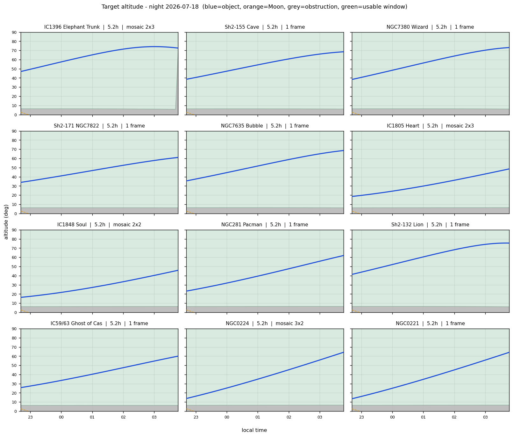

<div align="center">

# HARP

#### *image the sky your balcony can actually see*

### **H**orizon-**A**ware **R**ecommender and **P**lanner

> A CLI planner for deep-sky astrophotography sessions. Given a date, a site, your
> telescope + camera, the **real horizon of your spot** and the Moon, HARP ranks the
> targets you can actually image tonight — usable windows, Moon impact, and mosaic
> framing tailored to your rig.

[](https://pypi.org/project/harp-astro/)
[](https://github.com/szaghi/harp/actions/workflows/ci.yml)
[](https://www.python.org/)
[](https://github.com/szaghi/harp/issues)

[](licensing/LICENSE.gpl3.md)
[](licensing/LICENSE.bsd-2.md)
[](licensing/LICENSE.bsd-3.md)
[](licensing/LICENSE.mit.md)

<div>
<table>
<tr>
<td><b>🧱 Horizon-aware visibility</b><br><sub>Measure your site's obstructions once as an azimuth-dependent mask (<code>.hrz</code>, N.I.N.A.-compatible). A target counts as observable only when its altitude clears the ridge/wall <em>in its own direction</em> — not against an idealized flat horizon. <a href="https://szaghi.github.io/harp/guide/usage#build-a-horizon-file">Horizon guide</a></sub></td>
<td><b>⏱️ Continuous imaging windows</b><br><sub>Per target: total usable hours during astronomical darkness plus the longest <em>continuous</em> run before it enters a blocked sector — the number you actually size exposures and mosaic panels on. <a href="https://szaghi.github.io/harp/guide/usage#reading-the-output">Reading the output</a></sub></td>
</tr>
<tr>
<td><b>🏆 Desirability ranking</b><br><sub>Every target gets a 0-100 score: a weighted geometric mean of continuous window, total hours, peak altitude (inverse-airmass), Moon verdict, and how well the object fills your field of view — so one hopeless factor sinks a target instead of averaging away. <code>--sort hours</code> restores the classic order.</sub></td>
<td><b>🌙 Moon impact model</b><br><sub>Phase and separation folded into a per-target verdict — <code>none</code>, <code>ok(NB)</code>, <code>low/med/high</code> — with narrowband auto-derived from the object type: planetaries, supernova remnants and HII regions shrug at a Moon that ruins broadband RGB.</sub></td>
</tr>
<tr>
<td><b>🖼️ Mosaic framing &amp; panel coordinates</b><br><sub>Your focal length + sensor decide <code>1 frame</code> or <code>mosaic NxM</code>; <code>harp mosaic</code> then emits the actual per-panel RA/Dec centers (overlap-aware, position-angle rotated, correct at any declination) — plus single-frame crop suggestions for the monsters. <a href="https://szaghi.github.io/harp/guide/usage#mosaic-panel-coordinates">Mosaic guide</a></sub></td>
<td><b>🎯 N.I.N.A. integration</b><br><sub>The same <code>.hrz</code> horizon drives both tools, and <code>--nina</code> exports ranked targets or mosaic panels as CSVs N.I.N.A.'s sequencer imports directly — verified against N.I.N.A.'s actual parser source. Plan in HARP, shoot in N.I.N.A., retype nothing. <a href="https://szaghi.github.io/harp/guide/usage#nina-integration">N.I.N.A. guide</a></sub></td>
</tr>
<tr>
<td><b>🔭 Offline catalogues + your own</b><br><sub>Curated large emission nebulae (deliberately <em>not</em> magnitude-filtered), full Messier/NGC/IC via <a href="https://github.com/mattiaverga/PyOngc">pyongc</a> (<code>--catalogs M,NGC,IC</code>), and a user targets file that overrides everything (<code>--targets</code>). Cross-identification dedup: M42 and NGC1976 are one object, M43 stays its own. No network at run time.</sub></td>
<td><b>📈 Table, CSV, charts, links</b><br><sub>A ranked terminal table, a CSV for your session log — each target with an informative web link (SIMBAD, Wikipedia, AstroBin, or Aladin, built offline) — altitude charts with the horizon band overlaid, and <code>harp info TARGET</code> for details on demand.</sub></td>
</tr>
</table>
</div>

**[Full documentation](https://szaghi.github.io/harp/)** — installation, usage, horizon measuring, configuration

</div>

---

## What HARP does

```bash
harp plan                                    # tonight, default site/optics from config
harp plan 2026-08-15 --site balcony --optics newton800
harp plan --catalogs M,NGC,IC --targets my_targets.yaml   # full catalog + your objects
harp plan --nina tonight.csv                 # export ranked targets for N.I.N.A.
harp mosaic IC1396 --pa 30 --nina panels.csv # per-panel coords -> N.I.N.A. sequencer
harp list                                    # sites and optics defined in the config
harp horizon points.yaml -o balcony.hrz      # measured vertices -> .hrz horizon file
```

```
=== Night 2026-08-15 | Castelli Balcony 41.7380,12.8899 ===
Astronomical darkness: 21:53 -> 04:32 local
Moon: ~12% illuminated  |  above horizon: below horizon all night
Setup: 800 mm + custom 23.5x15.7
Field of view: 101' x 67'  |  horizon: balcony.hrz

 # object                 score kind      const   hrs cont       window altMx   az moonSep   Moon  frame
--------------------------------------------------------------------------------------------------------
 1 NGC281 Pacman             99 Nebula    Cas     6.7  6.7  21:53-04:28    75    0     127   none  1 frame
 2 NGC7380 Wizard            99 Nebula    Cep     5.2  5.2  21:53-03:03    73    0     124   none  1 frame
 3 NGC1039                   99 Open Clus Per     6.7  6.7  21:53-04:28    71   78     128   none  1 frame
 4 IC59/63 Ghost of Cas      99 Nebula    Cas     6.7  6.7  21:53-04:28    71  360     122   none  1 frame
 5 Sh2-155 Cave              98 Nebula    Cep     5.8  5.8  21:53-03:38    69    0     121   none  1 frame
```



The typical flow: **measure the horizon once → generate the `.hrz` → load it
in N.I.N.A. and in HARP → plan the night → export the ranked targets (or the
mosaic panels) straight into N.I.N.A.'s sequencer.** See
[`examples/`](examples/) for a working config, horizon file, and sample outputs.

## The name

A *harp* is the celestial Lyre — the constellation **Lyra**, home of Vega and the
Ring Nebula. And the acronym leads with the input most planners ignore: your
horizon.

## Installation

```bash
pip install harp-astro
```

The distribution is `harp-astro` (the bare PyPI name is squatted by an empty
project; a PEP 541 request is pending) — the installed package and the CLI
command are plain `harp`.

From source:

```bash
git clone https://github.com/szaghi/harp
cd harp
make dev
```

## Configuration

Sites (position + `.hrz` + timezone) and optical setups (focal + sensor) live in
`sites.yaml`, searched in the current directory and `~/.config/harp/`.
Precedence: **CLI option > config value > built-in default**. Details in the
[usage guide](https://szaghi.github.io/harp/guide/usage).

## Development

```bash
make dev     # editable install with dev extras into .venv
make test    # pytest with coverage
make lint    # ruff check + format check (read-only)
make fmt     # ruff auto-fix + format
```

Releases: `./release.sh --major|--minor|--patch|X.Y.Z` (trunk model on `main`;
tag push triggers CI → PyPI).

## Authors

**Stefano Zaghi** ([@szaghi](https://github.com/szaghi))
>HPC/CFD researcher by day, balcony astrophotographer by night. Owns a Newton 200/800 f/4 and a balcony whose entire southern hemisphere is a wall. Measured the horizon with a phone compass while fending off a magnetized railing, then wrote a planner rather than accept that M8 belongs to the neighbours.

**Claude** ([Anthropic](https://www.anthropic.com))
>Large language model, second author, zero telescopes. Has never seen the night sky — or anything else — yet computed where the Moon would be at 03:46 and was right. Refactored the whole toolkit between dusk and dawn, no coffee involved; accepts payment in tokens and byte-identical CSVs.

## License

Multi-licensed under GPL-3.0-or-later, BSD-2-Clause, BSD-3-Clause, and MIT —
choose the one that fits your use. See [`licensing/`](licensing/).
